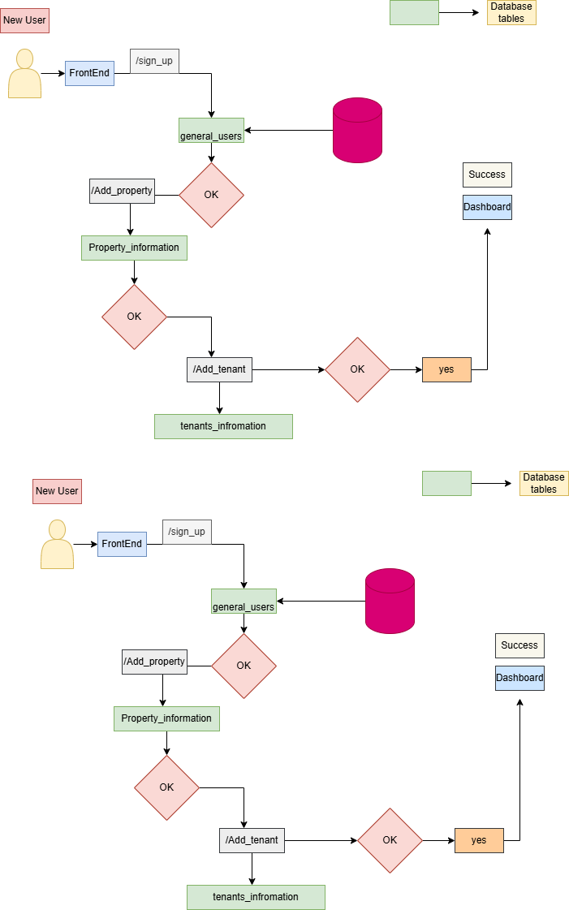
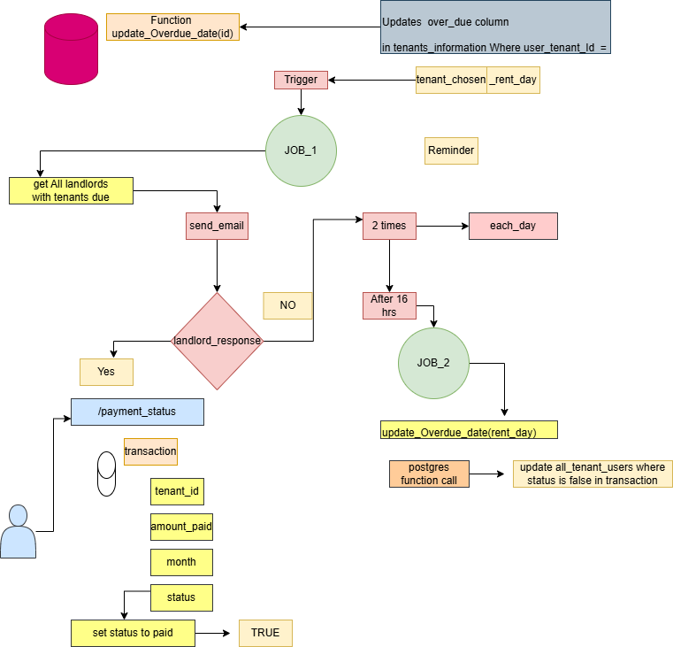

# PROMAN

PROMAN is a web application designed to help property owners and managers efficiently track rent payments, maintain financial records, and analyze the performance of their properties.

---

## Features

- **Tenant Management**: Add, update, and manage tenant information.  
- **Rent Tracking**: Record and track rent payments with due dates and reminders.    
- **Property Performance Dashboard**: Visualize property performance over time with charts and summaries.  
- **Reports**: Generate detailed reports for individual properties or overall portfolio performance.  

---

## TechStack

- **Frontend**: HTML, CSS, JavaScript 
- **Backend**: Java (Javalin)  
- **Database**: PostgreSQL
- **Quartz API** Implementes Automation with Qaurtz API Jobs to send reminders to users and tracks overdue day of tenants
---

## Project_Overview

1. **Sign up **  

sign_up_session flow-part1.png

- Setting the databse model for new user.
- **ProMan REQUIRES each user(property_owner) to provide information about they rental properties**

##Business Logic(Reminders and tracking tenant payemnts)
3. The functionality of the business depends on QUARTZ APIS<JOBS> w
   - Jobs is Quarts excute at a given time and run the specefied programm
   - PROMAN runs serveral jobs, One is sending emails when  a property owner has a tenant due
   - Another Job tracks tenants overdue tenants
   - **The Overall design of the business Logic**   

  

