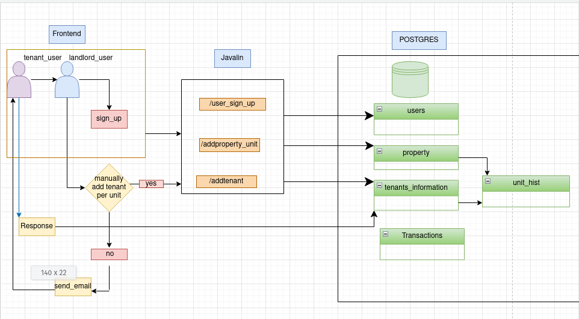

# PROMAN

PROMAN is a web application designed to help property owners and managers efficiently track rent payments, maintain financial records, and analyze the performance of their properties.

---

## Features

- **Tenant Management**: Add, update, and manage tenant information.  
- **Rent Tracking**: Record and track rent payments with due dates and reminders.  
- **Financial Records**: Maintain detailed financial logs for each property, including income, expenses, and profitability.  
- **Property Performance Dashboard**: Visualize property performance over time with charts and summaries.  
- **Reports**: Generate detailed reports for individual properties or overall portfolio performance.  

---

## Technologies Used

- **Frontend**: HTML, CSS, JavaScript (optionally React/Vue)  
- **Backend**: Java (Javalin)  
- **Database**: PostgreSQL /   
---

## Project_Overview

1. **In development**  
``
sign_up_session flow-part1.png

# Design principle -- Separating aspects that vary from those that stay the same || When new requirements are needed, changes are implemented only for the parts that vary.
# In this project:
# The aspects that vary are tenants
# A unit can get a new tenant, but payment rules still apply.
